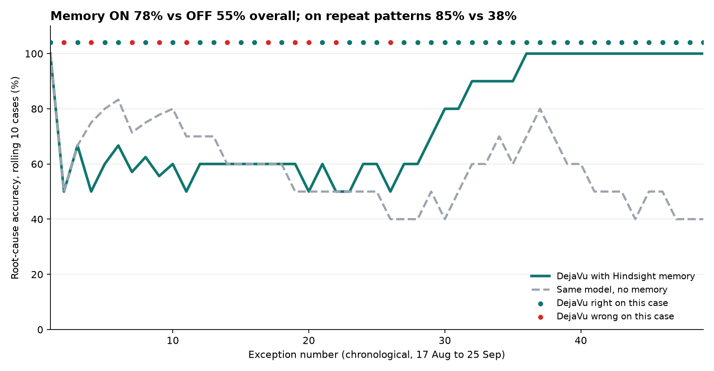
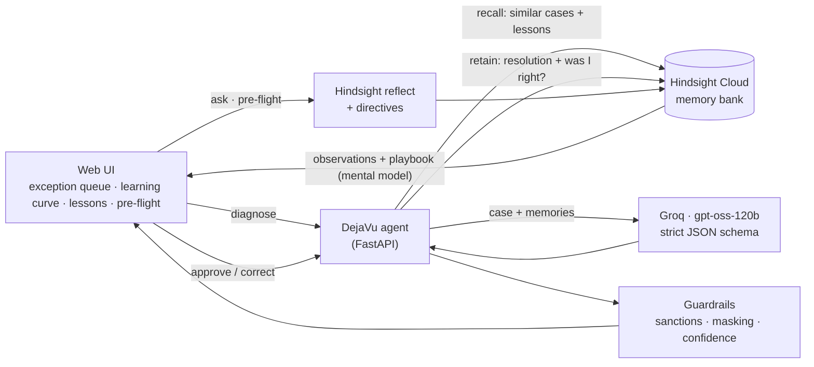

# DejaVu: the payments-ops agent that has seen this before

**DejaVu remembers every failed payment your operations desk has ever fixed. It uses that memory to diagnose the next one in seconds and warns you before a payment fails.** It is built on [Hindsight](https://github.com/vectorize-io/hindsight) agent memory, with Groq for fast reasoning.

**▶ [Try the clickable demo](https://aaronthomas7.github.io/dejavu-payments-agent/)** (no install; every answer in it was recorded from a real run)


<sub>Chart generated by `scripts/replay.py`: memory ON vs the same model with memory OFF, replaying six weeks of exceptions in date order.</sub>

---

## The problem

Every day, some cross-border payments bounce back or get stuck. Common causes:

- a wrong account number
- a name that doesn't match
- arriving after the receiving bank's cut-off
- a missing invoice number
- a sanctions-screening hit on an innocent company with a similar name

An analyst has to investigate each one. The same problems keep coming back with the same banks and clients. But "how we fixed it last time" lives in one senior person's head, old emails and a spreadsheet. When that person goes on leave or resigns, the desk starts from zero.

The cost is large. Swift reports that investigating delayed cross-border payments costs the industry [more than $1.6 billion a year](https://paymentsindustryintelligence.com/swift-targets-1-6bn-cost-cross-border-payment-investigations/). Some banks pay [up to $20 million](https://www.swift.com/news-events/news/its-time-transform-exceptions-and-investigations) in fees and penalties for delayed settlements.

A stateless chatbot cannot fix this. Every exception is "new" to it. The value is in remembering.

## What DejaVu does

```
new exception ──► RECALL similar past cases + learned lessons (Hindsight)
              ──► REASON with Groq gpt-oss-120b (strict JSON: root cause, confidence, evidence, fix, draft message)
              ──► GUARDRAILS (sanctions = humans only, mask account numbers, no evidence = no high confidence)
              ──► analyst clicks Approve or Correct
              ──► RETAIN the resolution *and whether DejaVu was right* into Hindsight
              ──► Hindsight consolidates repeats into lessons and rewrites the Playbook
```

| Case 1 | Case 10 | Case 40 |
|---|---|---|
| "Client keyed wrong details. Ask them to verify." (generic guess) | "Pearl Delta migrated to 15-digit accounts on 25 Aug. Prefix 601." | Most repeats are diagnosed with evidence. Pre-flight check warns *before* sending. |

## How Hindsight memory is used

Memory is the product. Without it, DejaVu is a generic classifier (see the memory-OFF baseline).

| Hindsight feature | What DejaVu does with it | Code |
|---|---|---|
| **Memory bank** | One bank = the desk's shared brain (`dejavu-payments-desk`), with a `background`, `retain_mission` and `reflect_mission` | `app/memory.py` → `setup()` |
| **retain** | Every resolved exception is stored as a narrative with `timestamp` (case date), `document_id` (case id), `tags` (bank, client, error code, currency), `metadata` (root cause, was DejaVu right) and `entities` | `retain_case()` |
| **Experience memory** | The retained text says *"I (DejaVu) diagnosed this as X, which was wrong; the correct root cause was Y"*. The agent learns from its own mistakes, not just from facts | `prompts.resolved_case_content()` |
| **recall (TEMPR)** | Two recalls run in parallel: a broad semantic + keyword + graph + temporal recall, and a **bank-scoped** recall (`tags=["bank:PDCB"]`, `tags_match="any_strict"`). `query_timestamp` is the case date, so "recent" means recent *for that case* | `recall_for_case()` |
| **Observations** | Hindsight consolidates repeated cases into lessons with proof counts and version history (e.g. *"Pearl Delta requires 15-digit accounts since 25 Aug (×5)"*). Shown in **What it learned** | `lessons()` |
| **Mental model** | `exception-playbook`: a standing answer that Hindsight rewrites in **delta mode** after consolidation. It is the desk's self-writing playbook | `_ensure_playbook()`, `playbook()` |
| **reflect** | "Ask DejaVu" and the **pre-flight check** reason over the whole bank. The pre-flight check uses `response_schema` for structured warnings | `ask()`, `precheck()` |
| **Directives** | Hard rules applied in reflect: *sanctions holds are human-only*, *mask account numbers*, *cite evidence*. The UI shows which directives were applied | `prompts.DIRECTIVES` |
| **Disposition** | Skepticism 4, literalism 4, empathy 2: an investigator's temperament | `prompts.DISPOSITION` |

## Architecture



- **Backend**: Python, FastAPI, `hindsight-client` (async), OpenAI-compatible SDK pointed at Groq. SQLite for the queue.
- **Frontend**: one static page (vanilla JS, Chart.js, marked, DOMPurify). There is no build step and it works offline once loaded.
- **Resilience**:
  - A rate limiter per API key keeps us under Groq's free-tier tokens/min. When a key's daily quota runs out, the next key (or the fallback model) takes over at once.
  - JSON output is checked against a strict schema. If that fails, we retry in JSON-object mode with a repair hint, then switch to a fallback model.
  - If memory goes down, the desk keeps working: diagnoses are marked *degraded*, and resolutions queue in an outbox and sync later.

## Does it actually learn? (the replay)

`scripts/replay.py` starts from an **empty** memory bank and walks through 49 historical exceptions (17 Aug to 25 Sep) in date order. For each one it:

1. asks the same model **without memory** (baseline),
2. asks DejaVu **with memory** (recall + reasoning),
3. scores both against the ground-truth root cause,
4. retains the analyst's resolution, so the next case can learn from it.

Memory ON can only beat memory OFF by learning from the cases it has already seen. The dataset is built so this is a fair test:

- The same error code maps to different root causes. For example, AC01 can mean a typo *or* a bank's new account format.
- Some rules depend on time. Nordkyst Bank changed its correspondent on 1 Sep. Golconda's cut-off depends on submission time.
- A case never sees its own resolution or any case from its future.

| Metric | Memory ON | Memory OFF |
|---|---|---|
| Root-cause accuracy (all cases) | _run the replay_ | _run the replay_ |
| Accuracy on repeat patterns | _run the replay_ | _run the replay_ |

Run it and the UI's **Learning curve** tab animates the results. `python scripts/fill_content.py` copies the numbers into the table above.

## Quickstart

**Windows, no terminal needed.** Download or clone the repo, put your keys in `.env` (copy `.env.example`), then double-click in `scripts\windows\`:

| Step | Double-click | What it does |
|---|---|---|
| 1 | `setup.bat` | creates `.venv`, installs packages, checks both keys (two `[ OK ]` lines) |
| 2 | `replay.bat` | the learning-curve replay (20-40 min), then records the clickable demo into `docs/demo` |
| 3 | `run.bat` | starts the app and opens <http://localhost:8000> |
| 4 | `publish.bat` | commits and pushes the results (optional) |

**Any OS, from a terminal:**

```bash
git clone https://github.com/aaronthomas7/dejavu-payments-agent.git && cd dejavu-payments-agent
python -m venv .venv
source .venv/bin/activate                 # Windows: .venv\Scripts\activate
pip install -r requirements.txt
cp .env.example .env                      # Windows: copy .env.example .env   -> then paste your keys
python scripts/check_setup.py
python scripts/replay.py --fresh          # 20-40 min on free tiers; builds memory + learning curve
uvicorn app.main:app --reload             # open http://localhost:8000
python scripts/export_demo.py             # optional: record the static demo for GitHub Pages
```

- **Hindsight Cloud**: sign up at <https://ui.hindsight.vectorize.io>, create an API key, and look at the bank's memory graph in the UI.
- **Groq**: create a key at <https://console.groq.com/keys>. The free tier works, with limits per key: 8K tokens/min and about 200K tokens/day. The replay plus the demo recording use roughly 300K, so you can list a second key after a comma (`GROQ_API_KEY=gsk_a,gsk_b`). DejaVu spreads calls across the keys, which also halves the replay time, and skips a key once its daily quota runs out.
- **Self-hosted Hindsight** works too. Set `HINDSIGHT_BASE_URL=http://localhost:8888` (see the [Hindsight docs](https://hindsight.vectorize.io/)).

**No keys yet?** `MEMORY_BACKEND=local LLM_BACKEND=offline uvicorn app.main:app` runs the UI with simple offline stand-ins, so you can click around. Those stand-ins are for development only; the UI shows a banner and the replay chart is watermarked.

## Demo script (3 minutes)

1. **Exception desk → Pearl Delta, AC01**
   - Click **Compare with / without memory**. Without memory: "Client keyed wrong details."
   - With memory: "Beneficiary bank changed account format", with evidence from earlier Pearl Delta cases.
2. **Approve**. The resolution and "DejaVu was right" are retained.
3. **Rheinland Handelsbank, AC01**. Same error code, but DejaVu does *not* force the Pearl Delta pattern. It's a typo.
4. **Desert Rose Bank, sanctions hit**
   - DejaVu recognises the known false positive and cites the prior clearance.
   - The guardrail still requires Compliance. It never auto-releases.
5. **Learning curve** → **Replay the weeks**. Watch memory ON climb while memory OFF stays flat.
6. **What it learned**: consolidated lessons with proof counts, and the playbook Hindsight wrote.
   - Ask *"Can we auto-release the Desert Star sanctions hit?"* and the directive holds.
7. **Pre-flight check** → *Late INR payment to Golconda* shows a warning before sending: "arrives after the 14:30 SGT cut-off."

Keyboard: `J`/`K` next/previous case, `D` diagnose, `C` compare, `A` approve.

## Guardrails and edge cases

- **Sanctions**:
  - A screening hold can only be classified as a sanctions cause, and always requires a human. This is enforced in code (`app/guardrails.py`) *and* as a Hindsight directive.
- **Evidence and confidence**:
  - Without evidence from memory, confidence is capped at 60%.
  - Evidence references the model invents are dropped.
- **Privacy**: account numbers and IBANs are masked in drafted messages.
- **Model failures**: strict-schema failure → JSON-object mode with a repair hint → fallback model → "Needs human review". The analyst's screen never crashes.
- **Memory outage**: diagnoses continue without history and are flagged, and resolutions are queued and flushed later.
- **Re-rehearsal**: `POST /api/admin/reset-demo` reopens the live cases and deletes their retained documents from the bank.

## Project structure

```
app/
  main.py         FastAPI routes + static UI
  agent.py        recall -> reason -> guardrails -> retain
  memory.py       Hindsight integration (and an offline stand-in for tests)
  llm.py          Groq client: rate limiting, strict JSON, retries, fallback
  prompts.py      every prompt, mission, directive and the playbook query
  guardrails.py   deterministic safety rules
  taxonomy.py     the 15 root causes
  store.py        SQLite queue + retain outbox
  static/         index.html, app.js, styles.css, vendored libs
scripts/
  generate_dataset.py   the synthetic 6-week dataset (fictional banks and companies)
  replay.py             learning-curve evaluation
  check_setup.py        verify keys
  seed_memory.py        load history without evaluating
  fill_content.py       copy replay numbers into this README
  export_demo.py        record a real run as the static clickable demo (docs/demo)
  windows/              double-click helpers: setup, replay, run, export_demo, publish
tests/            33 offline tests (pytest)
data/             history.json (49 cases), live.json (10 open cases), entities.json
docs/             learning_curve.png and the recorded demo served by GitHub Pages
```

## The data

All banks, BICs, companies and account numbers are **fictional**. The reason codes are real ISO 20022 codes (AC01, AC04, AM04, AM05, BE01, RC01, RR04).

The six weeks contain eight recurring patterns (P1 to P8 in `scripts/generate_dataset.py`), plus one-off cases that share the same error codes. That mix is how a real desk looks, and it is what makes memory necessary rather than decorative.

## Limitations and what's next

- 49 historical cases is a small sample. The replay proves the mechanism, not a production accuracy number.
- Next steps:
  - ingest real exception feeds (camt.029 / pacs.002, Swift gpi tracker)
  - per-analyst preferences with tag-scoped memories
  - webhooks for Hindsight consolidation events to push new lessons to the desk
  - a knowledge page per counterparty bank

## Team

_Team name · member names · roles_

## License

MIT
